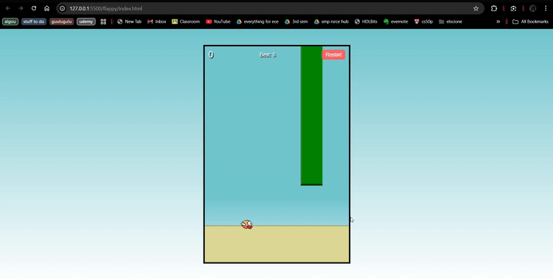

# Flappy Bird

A simple Flappy Bird clone built with plain HTML, CSS, and JavaScript. Pipes and the bird are regular DOM elements animated via `requestAnimationFrame`.

## How to Run
- Open `index.html` in your browser (no build step required).
- Best tested in a modern Chromium, Firefox, or Edge browser.

## Controls
- Click (mouse) or press any key to flap.
- Click the Restart button after a collision to play again.

## Files
- `index.html`: Markup and HUD elements.
- `style.css`: Layout, sprites, and visual styles.
- `game.js`: Game loop, physics, pipe spawning, scoring, and collision.

## Tweakable Settings (in `game.js`)
- `gravity`: Downward acceleration per frame.
- `jumpStrength`: Upward velocity applied on flap (negative number).
- `maxFallSpeed`: Limits how fast the bird can fall.
- `pipeGap`: Vertical gap between top and bottom pipes.
- `pipeSpeed`: Horizontal pipe speed.
- `pipeInterval`: Milliseconds between pipe spawns.

Tip: Lower `gravity` and/or reduce the magnitude of `jumpStrength` (e.g., from `-7` to `-5`) for a gentler feel. You can also slow `pipeSpeed` or increase `pipeGap` to make the game easier.

## Sprite Credit
Bird sprite sourced from the open flappy-bird-assets repository:
- https://raw.githubusercontent.com/samuelcust/flappy-bird-assets/master/sprites/yellowbird-midflap.png

All rights belong to their respective owners; used here for educational/demo purposes.

